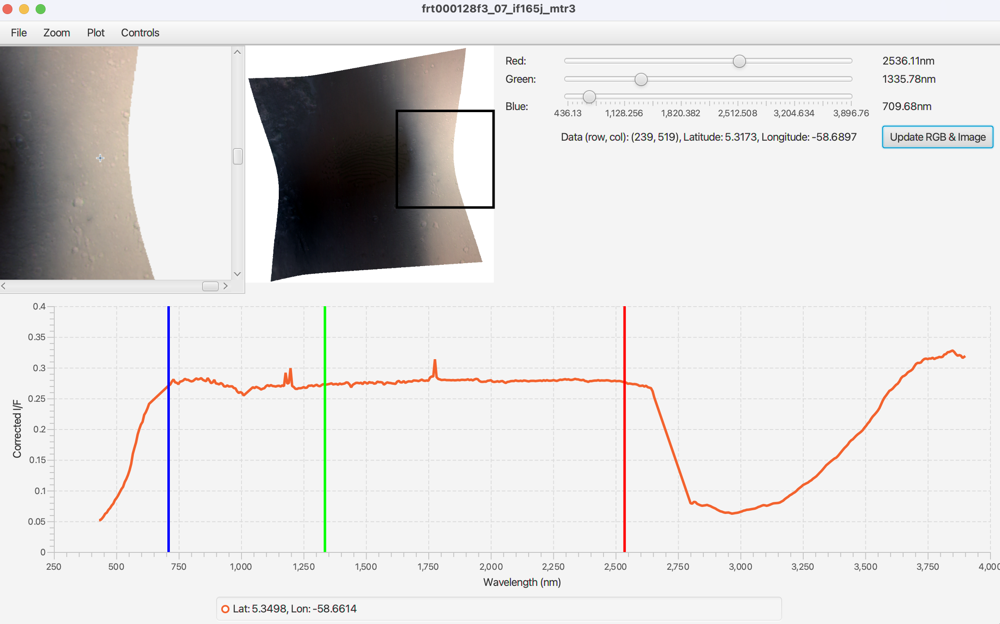

# Improved Color from CRISM
Python script to create true color images replicating human color vision from data collected by CRISM VNIR visual light multispectral imaging spectrometer on board of Mars Reconnaissance Orbiter (MRO).
The original code this modified version is based on was not producing correct true color images. The correct color calibration in the visual light range can be verified by looking through a telescope at Mars and comparing the visually observed polar ice caps color with the human vision rendered image created by the software. Both should show a white sunlight spectrum during normal clear weather conditions.

## Description

This Python package converts a Compact Reconnaissance Imaging Spectrometer for Mars (CRISM) data cube to the color space of human perceptual color. It integrates multispectral data across the visual light wavelength range and converts it into the sRGB color space. Currently, this package is only capable of processing Map-projected Targed Reduced Data Records (MTRDR), which represent the highest level of processing by the CRISM team. MTRDR images are map-projected, have the instruments 3 detectors joined into a single image, and are processed to reduce signal from atmospheric features (water ice/dust) and instrumental artifacts.

This code was developed to create true color visualization of hyperspectral MRI CRISM imaging data. It is free for personal use and academic presentations and publications. Please provide an acknowledgement in your visualization/presentation/publication to the author of is modified version (Holger Isenberg https://areo.info) and the original author's code of https://github.com/AsterAphelion/color-from-crism when using this work.

This forked version is based on the code from https://github.com/AsterAphelion/color-from-crism and is limited to CRISM VNIR (visual light, VIS) processing and adds an improved instrument calibration for CRISM VNIR 362nm - 1053nm to approach true color representation for humans.

The spectrum of map-projected targeted reduced data records (`*if*mtr3.lbl/img` pairs) in the VNIR range shows an unexplainable linear gradient reducing the reflectance (I/F) of plain white surface by a factor of 2 to 3 at the short wavelength VNIR spectrum end at 362nm compared to the long wavelength VNIR spectrum end at 1053nm. That gradient is caused by the missing calibration of the mtr3 files where the socalled volcano scan calibration is only applied to the IR range and not the VIS range.

White surfaces like northern polar cap snow is expected to show a flat I/F spectrum, as can be verified by telescope observations form Earth or from other cameras in Mars orbit.

For the improved calibration, the spectrum of white snow surfaces extracted from existing CRISM VNIR `if*mtr3` images needs to be manually extraced with http://crism.jhuapl.edu/JCAT. Start JCAT and load `*if*mtr3.img`. It will require in parallel the files `*wv*mtr3.tab` and the pair `*su*mtr3*.lbl .img`. In JCAT select a white surface spot and export the spectrum as CSV file `mtrdr_whiteflat.csv` via File -> Save Spectral Data. The file `mtrdr_whiteflat.csv` will be loaded by crism.py.



The image-viewer's illuminant is changed from D65 to the more common D55 of current screens.

Example images showing white surface which can be used to extract the mtrdr_whiteflat.csv from:
* frt000128f3_07_if165j_mtr3

## Setup and Use

```
git clone https://github.com/isenberg/improved-color-from-crism.git
python3 -m pip install --user numpy attrs spectres rasterio fire
cd improved-color-from-crism
ln -s frt000128f3_07_if165j_mtr3_spectrum_snow.csv mtrdr_whiteflat.csv
python3 crism.py mtrdr_to_color --file=hrl000095c7_07_if182j_mtr3.lbl --name=hrl000095c7_07_if182j_mtr3
open hrl000095c7_07_if182j_mtr3_VIS.png
```

To produce PNG files from all `*if*mtr3` images in a specific directory, written into the same directory:
```
./crismcal.sh DIRECTORY
```

### For Human Perceptual Color

The `mtrdr_to_color()` function uses integrates the CRISM VNIR multispectral data in its usually about 80 6.5nm wide bands into an sRGB image.

User input: `python3 crism.py mtrdr_to_color --file="[cube_name].lbl" --name="[output_name]"`. The standard outputs from this function include the following:

- 'VIS' - sRGB true color image, covering the wavelength range from 380 - 780 nm

Example usage to create calibrated output file `hrl000095c7_07_if182j_mtr3_VIS.png`:
```
python3 crism.py mtrdr_to_color --file=hrl000095c7_07_if182j_mtr3.lbl --name=hrl000095c7_07_if182j_mtr3
```

Required input files available on https://ode.rsl.wustl.edu/mars/mapsearch as layers -> Derived Map-projected MTRDR: `*if*_mtr3.lbl`, `*if*_mtr3.img`

## Requirements
- requirements.txt

## Acknowledgements
Original code: https://github.com/AsterAphelion/color-from-crism 

This code makes heavy use of the 'ColourSystem' class [described on the SciPython blog](https://scipython.com/blog/converting-a-spectrum-to-a-colour/). The original code also used the [SpectRes package](https://spectres.readthedocs.io/en/latest/) to convert CIE matching functions to different wavelength ranges.
